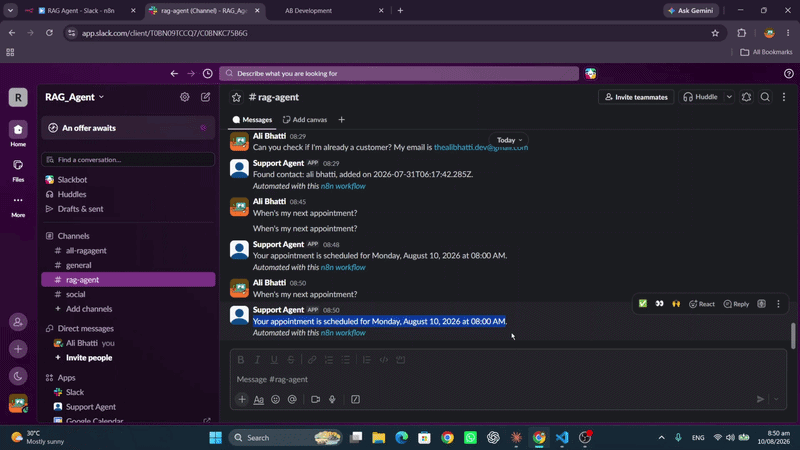

# AI Support & Sales Agent — RAG + Live CRM Actions

An agentic AI support system that answers questions grounded in real documents using hybrid retrieval and citations, and takes live actions in a real CRM (GoHighLevel) — contact lookups, appointment status checks, and automatic lead tagging. Deployed as a live Slack bot via n8n, with a working evaluation harness.



[Watch the full demo video](https://www.linkedin.com/posts/ali-hassnain-bhatti-1a0506312_aiagents-rag-langchain-ugcPost-7493498449347289088-AiGX/?utm_source=share&utm_medium=member_desktop&rcm=ACoAAE90BYgBQ0oeKLBO3aYcAnU7PbU8sp-OTcw)

## Why this project

Most "RAG chatbot" projects stop at "upload a PDF, ask a question, get an answer." This one goes further: it decides for itself whether a question needs document knowledge, a live CRM lookup, or just casual conversation, and it backs every document-based answer with a citation and a confidence score, refusing to answer rather than hallucinating when it isn't sure.

## How it works

1. A message comes in (via Slack, or directly through the API)
2. The agent classifies the query into one of three types: DOCS, CRM_LOOKUP, or APPOINTMENT_STATUS (anything else falls back to general conversation)
3. DOCS queries: hybrid search (vector + BM25 keyword search, merged via reciprocal rank fusion) retrieves the most relevant chunks from a ChromaDB knowledge base; the model answers strictly from that context, citing sources, and explicitly declines to answer if confidence is low
4. CRM_LOOKUP queries: the agent calls GoHighLevel's live API to check if the person is an existing contact
5. APPOINTMENT_STATUS queries: the agent checks the CRM contact's real upcoming appointments via GHL's calendar API
6. Behind the scenes, if a contact asks pricing-related questions repeatedly, the agent automatically tags them as "high-intent" in the CRM, turning conversation signals into CRM data, not just answers

## Architecture

```
User Message (Slack)
        |
        v
n8n Webhook (responds immediately to avoid Slack retries)
        |
        v
Bot-loop filter (ignores the bot's own messages)
        |
        v
FastAPI Agent (Python)
        |
        |-- Classify: DOCS / CRM_LOOKUP / APPOINTMENT_STATUS / GENERAL
        |
        |-- DOCS ---------------> Hybrid Retrieval (Vector + BM25) --> Gemini (answer + confidence + citations)
        |
        |-- CRM_LOOKUP ---------> GoHighLevel API (live contact search)
        |
        |-- APPOINTMENT_STATUS -> GoHighLevel API (live calendar check)
        |
        |-- (Pricing questions x2) --> Auto-tag contact as "high-intent" in GHL
        |
        v
n8n Slack node --> Reply posted in channel
```

## Why Python instead of pure n8n + GHL

My other two projects, an AI Voice Agent and an AI Lead Qualification Agent, are built entirely with n8n and GHL, showing I can automate real business workflows with little to no custom code. This project deliberately uses Python where n8n genuinely can't do the job:

- Embeddings and vector search: no n8n node generates embeddings or runs similarity search
- Hybrid retrieval (vector + BM25 fusion): combining and re-ranking two search algorithms is real algorithmic logic, not drag-and-drop
- Multi-step agent reasoning: classifying intent, parsing structured JSON, validating and retrying is cleaner and more reliable as code than chained no-code nodes
- An automated evaluation harness: running test cases and scoring accuracy is inherently a script's job

n8n is still used for what it does best here: webhook handling, Slack delivery, and event orchestration. This project is intentionally the "when code is the right tool" counterpart to my no-code automation work.

## Tech Stack

| Layer | Tool |
|---|---|
| Language | Python |
| RAG Framework | LangChain |
| Vector Store | ChromaDB |
| Keyword Search | BM25 (rank_bm25) |
| LLM | Google Gemini |
| CRM | GoHighLevel (live API) |
| Delivery | Slack + n8n |
| Backend | FastAPI |

## Features

- Hybrid retrieval (semantic + keyword search, merged via reciprocal rank fusion)
- Citation tracking on every document-based answer
- Confidence-based fallback that refuses to answer rather than hallucinate
- Live CRM contact lookup (GoHighLevel API)
- Live appointment status checking
- Automatic lead tagging based on conversation behavior
- Deployed as a live Slack bot with duplicate-response and bot-loop prevention
- Automated evaluation harness with documented, honest results

## Evaluation Results

A 13-case automated test set (evaluate.py / eval_dataset.py) covering standard questions, misspellings, partial knowledge-base coverage, and ambiguous mixed-intent queries:

- Answer accuracy: 6/8 on the hardened test set (75%)
- Classification accuracy: 7/8 (88%)

Known limitations surfaced by evaluation:

- Messages combining two intents in one sentence (for example, "check my account and also tell me your plans") are currently routed to a single classification rather than handled in parallel. This is a natural next step for multi-intent handling.
- The agent correctly refuses to answer when a topic isn't covered by its knowledge base, even when a plausible-sounding answer could be guessed. This was verified directly by the evaluation set and is by design rather than a gap.

## Setup

### Prerequisites

- Python 3.10+
- A free Google Gemini API key
- A GoHighLevel account with a Private Integration Token
- n8n (cloud or self-hosted) plus a Slack app, for live deployment

### 1. Clone and install

```bash
git clone https://github.com/alibhatti59/ai-rag-crm-agent.git
cd ai-rag-crm-agent
python -m venv .venv
.venv\Scripts\activate
pip install -r requirements.txt
```

### 2. Configure environment

Create a .env file (see .env.example):

```
GEMINI_API_KEY=your_gemini_api_key
GHL_TOKEN=your_ghl_private_integration_token
GHL_LOCATION_ID=your_ghl_location_id
GHL_CALENDAR_ID=your_ghl_calendar_id
```

### 3. Build the knowledge base

Add your own documents to docs/, then run:

```bash
python ingest.py
```

### 4. Run the agent locally

```bash
python agent.py
```

### 5. Run the API server

```bash
uvicorn api:app --reload
```

### 6. Run the evaluation suite

```bash
python evaluate.py
```

### 7. Deploy to Slack (optional)

- Import `slack-integration-workflow.json` into n8n as a starting point
- Update the HTTP Request node's URL to point to your running `/ask` endpoint
- Set up a Slack app with Event Subscriptions pointing to this n8n workflow's webhook
- n8n calls this project's /ask endpoint (via ngrok for local testing, or a public deployment for production) and posts the response back to Slack

## Roadmap / Possible Extensions

- Multi-intent handling in a single message
- WhatsApp delivery alongside Slack
- Persistent conversation memory (currently stateless per message)
- Expanded CRM actions, such as updating contact fields or creating tasks for human follow-up on low-confidence answers

## About

Built by Ali Hassnain Bhatti, AI Automation Engineer specializing in voice agents, RAG systems, and CRM/API integrations.

LinkedIn: https://www.linkedin.com/in/ali-hassnain-bhatti-1a0506312/ 
Email: thealibhatti.dev@gmail.com
